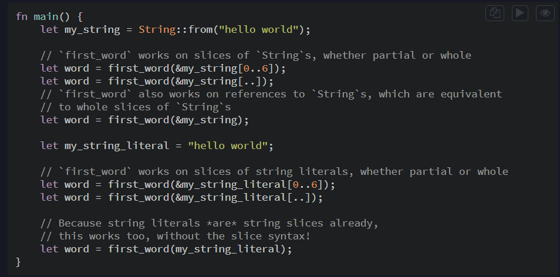

# Rust


* Rust Tooling


## Comments

- use `//` for one line comment.
- use `/* */` for multiline comment.

## Mutability - Immutability

* **Immutable** : that can't be changed once initialized and `mutable` is opposite of it.
* Every variable in rust is immutable by default until we make it mutable.

  ```rust
  let x=10; // immutable
  let mut x=10; // mutable
  ```

## Const vs Let

* **let**: help us to define `mutable/immutable` variables like above.
* **const**:
  * `mut` is not allowed.And must be annotated with type(eg. i32 or u32) while declaring it.
  * Always immutable and must be initialized while declaring it to literals or expression which result constant value in compile time.
  * unlike `let` it can be declared in global scope.And they are printed in code(compiler will assign the value of const to all places where it is used so no memory allocated for it at runtime).

    ```rust
    let x; x=10; // can be initialized later still immutable.
    const x=10; // must be initialized while declaring it.
    ```

## Shadowing

- Rust allows the same variable names in nest scopes which shadows the outer scope name.

  ```rust
  let x =5;
  {
    let x=10;
     println!(x); // output: 10
  }
  println!(x); // output: 5
  ```

## Data types

- Since rust is `statically` typed language it must know it's data type at compile time. Most of the time compiler can infer the type based on the value we assigned to them.
- **Scalar type:** scalar type repsent single value. Integers,floating-point numbers, Booleans, characters.

  - **Integers**

    

    - Here usize and isize types depends on the architecture of the computer our programm is running.
  - **Floating =>** let x: f32/64;
  - **Boolean =>** let x:bool = true/false;
  - **Character =>** let x:char = 'z' ; // In rust character is four bytes in size represent unicode scalar value.
- **Note:** rust don't do explicit type conversion for the literals so for that we have to do it.
  `let x = 5 as u64;`
- **Comound Types**

  ```rust
  // Tuples
  let tup: (i32,f64,u8) = (500,6.4,1);
  let (x,y,z) = tup; // destrucutre syntex
  // to access value : 1. either destructure them like above. 2. Or we can access tup.0, tup.1, tupe.2

  // Array
  let a = [1,2,3,4];
  let b:[i32; 5] = [1,2,3,4,5]; // [type; size]
  let c = [0; 5]; // [initial value; array_size]
  // to access values : a[0], [1]. but unlike c/cpp when we access the index which is not part of array our program will panic at runtime and exit.
  ```

## Statement and Expression

- Anything ended with `;` is called `statement` and `expression` is part of statement. `Expression` evaluates to a resultant value. While `statement` performs some action but do not returns the value.
- Eg of `statements` are : 1. anything ended with semicolon, 2. Function definition.
- Eg. of `expression` are : 1. calling a function is a expression, 2. calling a macro is epxression. 3. A new scope block created with curly braceses is an expression.
  **Note :**  `Rust` is expression based language. Where if we don't put `;` in the end then it will be treated as return value we'll see more on that later.

  ```rust
  let y = {
  	// this is epxression.
  	let x =3;
  	x+1
  	}  // after this value of y = x+1;
  ```

## Function

```rust

/*
* fn name(/* parameters */) -> return_type { value_to_return }
*/

fn five() -> i32 {5}

fn plus_one(x: i32) -> i32 {x+1}

```

## Control Flow

- Rust supports : `if, else if and else `  & `match : as switch case in other language`
- Loops
  - Infinite loop using : `loop { // statement }  `
  - It supports : `while loop` , `for loop : but iterates over ranges like(python) or collection, and works with iterators`.
- Loop labels : allows breaking out of nested loops.

```rust
fn main() {

    'outer: for i in 0..=5 /* this means 5 is also included */ { 
        for j in 0..5 {
            if j == 2 {
                break 'outer; // Breaks out of the outer loop
            }
            println!("i: {}, j: {}", i, j);
        }
    }
}

```

## Understanding Rust Data Model : Ownership, Bollowing, Slices

### Ownership and Borrowing.

- `Ownership` helps rust to provide memory safety without using the garbage collector. If those rules got voilated program won't compile.
- `Stack vs Heap` : Both are the parts of memory available to our code to use at runtime.

  - | Stack                                                                                                                                       | Heap                                                                                                                                                                                                                                             |
    | :------------------------------------------------------------------------------------------------------------------------------------------ | :----------------------------------------------------------------------------------------------------------------------------------------------------------------------------------------------------------------------------------------------- |
    | Allocating data is very fast : ~10-100 ns                                                                                                   | Allocating data is slow comparison to stack : ~100 - 1000ns                                                                                                                                                                                      |
    | Simple mechanism just allocate the data LIFO.                                                                                               | Complex mechanism first find right fit block then allocate and returns it's pointer.                                                                                                                                                             |
    | All data stored must have a known, fixed size and<br />data unknown at compile time or may change <br />at runtime will be stored on heap. | Since it's used for allocating data which is unknown size at compile time or<br />may changes at runtime. It first finds block that can fit the required data and then<br />returns the pointer to it whose size we know, and store it on stack. |
- **Ownership**

  - As we know there are two places where we can define out data 1. Stack , 2. Heap.
  - Stack Allocation : data created on this will be copied by value when we assign to another variable like happens in other languages.

    ```rust
    // here both x and y will have 10 value in there respective memory.
    let x =10;
    let y =x; 
    ```
  - Heap Allocation: That is where `ownership and borrowing` rules are seen. Each value in Rust has an owner (Always think for value stored in heap which will makes more sense here). There can only be one owner of data at a time. `Reason : The memory allocated on heap must have to be freed after use, otherwise it will create memory leak, rust does by calling drop method, now for calling drop rust must know which is actual owner of that data`. So as owner goes out of scope rust free that memory `because of drop trait` .
- **Move**

  ```rust

  let s = "Hello world" ; // this is immutable (hardcoded in compiled binary it's type is &str)
  let ss = s; // totally valid since both are part of the stack only.
  println!("{}",s);

  // Ownership transfer : We call this process MOVE.
  let s2 = String::from("Hello World");
  let s3 = s2;  // This is where MOVE happens and now s3 is owner of that heap data and s2 no longer valid. There is also api available to make deep copy of it so s2 and s3 can exist independently. eg. s3 = s1.cone();
  println!("{}",s2); // if we try to access the value now our program will panic.

  ```

  **Q. You might be wondered why this is doesn't seen on the stack variables ?**

  **R.** Rust has implemented the `copy trait` for all the primitive types. `Rust won't let us annotate a type with copy if the type or any of its internal type has implemented the Drop trait(this is implemented on the type which are stored on the heap)`.
- **Types implements the Copy trait :** All the integers, boolean, float, char , tuples(only if they only types having copy trait).

  ```rust
  // Here tuple does not have the copy trait, because here it using String which is using drop trait.
  let tup: (i32, String);
  ```
- **Borrowing**

  - Since we saw earlier that on assignment ownership transfered and this is applicable even for function when we pass the value. That's where borrowing comes in picture.
  - Let see why borrowing can be usefull, below are the example of transfering ownerships.

    
- Borrowing is  implemented using reference `(&)` which does not move data(just like you car can be borrow for use by your friends but it still your car). Now reference also can be given permission to mutate the borrowed data `Obvious : the owner of data must have the mutation permission in first place then only the borrower can be given same.`

```rust
fn main(){
let mut s1 = String::from("hello");
give_me_ref(&s1);
give_me_mutatin_ref(&mut s2);
}

fn give_me_ref(s: &String) {
 // do something with ref, but can't mutate it.
}

fn give_me_mutating_ref(s: &mut String){
// do something with ref, but now we can mutate it as well.
}
```


**Q. So seeing these things you might be thinking how rust stops from data races ?**

- **Ownership Rules :**  1. Each value in rust has a single owner `ownership of a value can be transferred, but at any given time, there is only one owner of that value`. 2. When the owner goes out of scope the value is dropped `This ensure that the memory is automatically free when it's no longer needed`.
- **Borrowing Rules :** We can have either one mutable reference or any number of immutable references to a value at any one time, but not both.

**Q. So dangling reference does not create problem, how does rust save us from those ?**

- Dangling references are the biggest issue of programming languages like cpp/c, But rust saves us by checking those scenarios at compile time only try to run the below code.

  

## Slice Type

- Slices let you reference a contiguous sequence of elements in a collection rather than the whole collection. A slice is a kind of reference, so it does not have ownership.
- And it  can also be given mutable permission.

  

 **Q. Why its good to use &str instead of &String ?**



- For other data types slice type will be represented as : &[i32/bool/...]
- This how we can create and pass the mutable slices.

  ```rust
  let mut s = "Hello world".to_string();
  data_add(&mut s[0..4]);

  fn data_add(container: &mut str){
  // we can mutate the data in container slice.
  }
  ```

  **Note: String slice range indices must occur at valid UTF-8 character boundaries, If you attempt to create a string slice in the middle of a multibyte character, the our program will exit with an error. For here example purpose we assumed string to have ASCII only. Will talk more on that later.**


## Structs and Methods

- Structs are the building block for creating the complex type `which we can create with tuple as well` but in this we can define names to it and structs can have the methods to it as well, structs does something like similar to classes in other programming language.
- **Types of structs**

  1. General Struct: which you will see in example below.
  2. Tuple type structs.
  3. Place holder structs.
- **Structs Methods** : There are 2 types of methods we can create with structs. 1. Associative methods `acts like static method in other programming language`, 2. Instance method `similar to function we define in classes`.

  **Note:** Struct can contain anytype of variable but for reference type we have to add the lifetime we'll see later how to use them in our structs, in below example we are only working with  non-reference types.
- **Self :** This is data type which represents the current instance of the struct. and all instance method first argument is one of these types 1. self `transfering ownership` , 2. &self `borrowing instance immutably` 3. &mut self `borrowing instance mutably`.

  ```rust
  #[allow(warnings)]

  #[derive(Debug)] // It enables struct to used inside the println!.
  struct User {
      active: bool,
      username: String,
  }

  // We can split this impl block to multiple impl blocks as well if code becomes too big.
  impl User {
      // Associative methods : Active like static method in other languages.
      // when the names are same we can omit the left side.
      fn new(active: bool, username: String) -> Self {
          Self { active, username }
      }

      // we can create user from other user object.
      // rust support destruct property but its must be in the end only.
      fn from(otheruser: Self, username: String) -> Self {
          Self {
              username,
              ..otheruser
          }
      }

      fn get_active_status(&self) -> bool {
          self.active
      }

      fn set_active_status(&mut self, active: bool){
          self.active = active;
      }

      fn get_username(&self) -> &str {
          &self.username
      }


  }

  // Other types of structs.

  // Tuple structs
  struct Color(i32, i32, i32);
  struct Point(i32, i32, i32);

  // Place-Holder Structs
  struct AlwaysEqual;


  pub fn test(){

      let user1 = User::new(true, String::from("sumant@patel"));
      // have to use {:?} or {:#?} for printing the struct or we can implement the display trait which we will look later.
      println!("{:?}",user1); 

      let color1 = Color(1,1,1);
      println!("{}",color1.0);

  }
  ```
